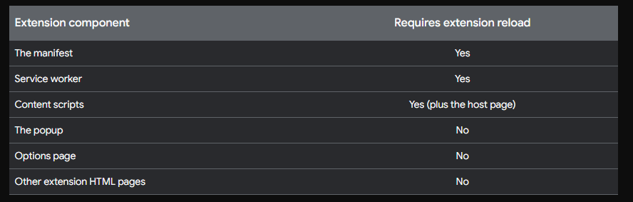

Starter Chrome Extension

Notes:

manifest is like the id file that holds all the info about the extension

when to reload the page

find console logs and errors

u can use browser logs

you can create a popup.js file in script in the html file

debugging using the popups -> inspect the page -> have popup.js file

errors will be in the extensions window

for structuing an extension project

manifest
background
scripts
popup
images